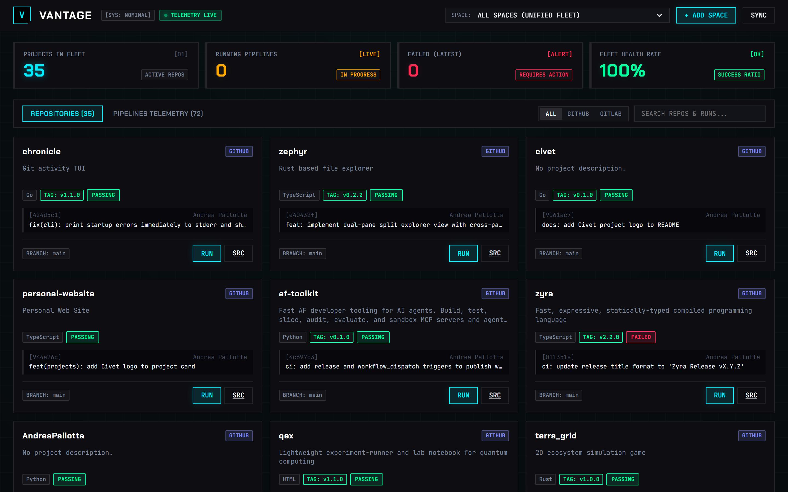
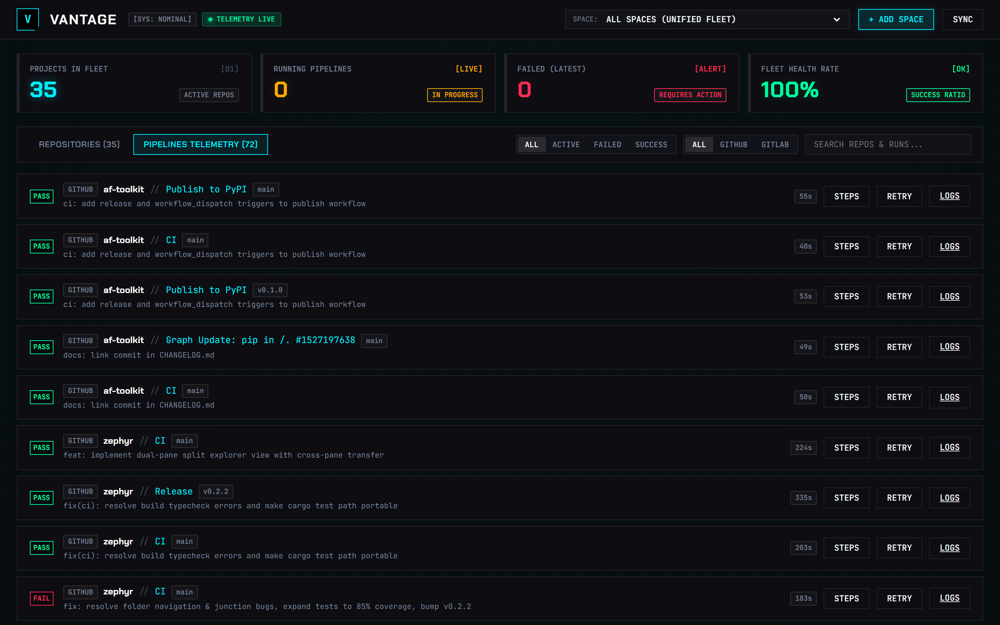
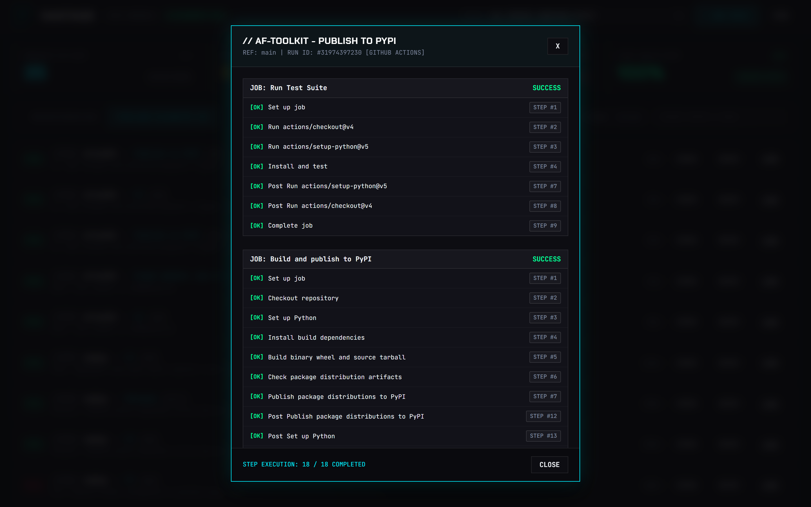
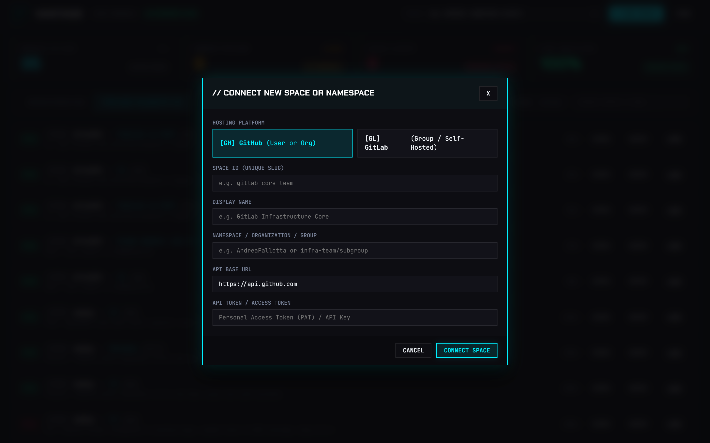

# Vantage

**Centralized Multi-Platform (GitHub & GitLab) Pipeline Dashboard**

Vantage provides unified visibility and control over repositories, commit vitality, release tags, and CI/CD workflow runs across all your GitHub and GitLab spaces.



---

## Key Capabilities

- **Fleet Overview**: Discovers and tracks repositories across multiple spaces with real-time status on default branches, commit vitality, forks, and tags.
- **Unified Pipeline Telemetry**: Aggregates GitHub Actions and GitLab CI pipeline runs in a single real-time stream.
- **Multi-Platform Support**: Connects to GitHub, public GitLab.com, and self-hosted GitLab instances with token authentication.
- **Multi-Namespace Switching**: Switch between individual groups/orgs or monitor all configured spaces in a unified fleet view.
- **Pipeline Orchestration**: Trigger any workflow on demand, retry failed runs, or cancel active executions directly from the UI or CLI.
- **Step-Level Inspection**: Inspect individual pipeline jobs, progress checkmarks, step names, and durations.
- **Dual Interfaces**:
  - **Embedded Web UI**: Cyber-Telemetry dashboard with live step inspector at `http://localhost:8080`.
  - **Terminal Commands**: Fast CLI commands (`vantage status`, `vantage runs`, `vantage spaces`, `vantage trigger`).

---

## Screenshots

### Real-Time Pipelines Feed


### Step-by-Step Pipeline Inspector


### Connect New Space (GitHub & GitLab)


---

## Installation

```bash
go install github.com/AndreaPallotta/vantage@latest
```

Or download pre-compiled binaries for Windows, Linux, and macOS from the [Releases](https://github.com/AndreaPallotta/vantage/releases) page.

---

## Quick Start

### Launch Web Interface
```bash
vantage
```
Opens the interactive telemetry dashboard at `http://localhost:8080`.

### CLI Fleet Summary
```bash
# Print fleet status table across all spaces
vantage status

# Monitor a specific space
vantage status --space AndreaPallotta
```

### List Configured Spaces
```bash
vantage spaces
```

### Add a New Space
```bash
vantage add-space --id gitlab-team --name "Team Services" --platform gitlab --url https://gitlab.com --namespace my-group --token $GITLAB_TOKEN
```

### Stream Pipeline Runs
```bash
# View recent workflow runs across all repos
vantage runs

# Filter runs for a specific repository
vantage runs zephyr
```

### Trigger a Workflow
```bash
# Trigger a release or CI pipeline on main
vantage trigger civet release.yml --ref main
```

---

## Configuration

Vantage reads configuration from `~/.vantage/config.json` or environment variables:

| Option | Env Var | Flag | Default | Description |
| :--- | :--- | :--- | :--- | :--- |
| `space` | `VANTAGE_SPACE` | `--space`, `-s` | `all` | Space ID to monitor or `all` for unified fleet |
| `token` | `GITHUB_TOKEN` | `--token`, `-t` | `gh auth token` | GitHub Personal Access Token |
| `port` | `VANTAGE_PORT` | `--port`, `-p` | `8080` | Port for the web dashboard |
| `auto_open` | `VANTAGE_AUTO_OPEN` | `--no-open` | `true` | Open browser on startup |

---

## License

MIT License. Built by [Andrea Pallotta](https://github.com/AndreaPallotta).
